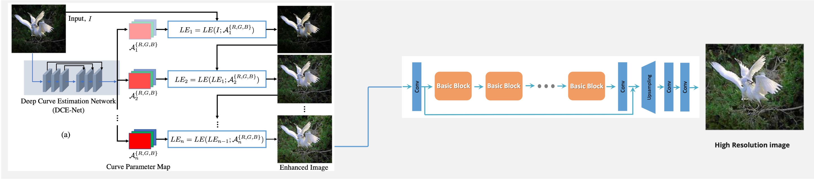
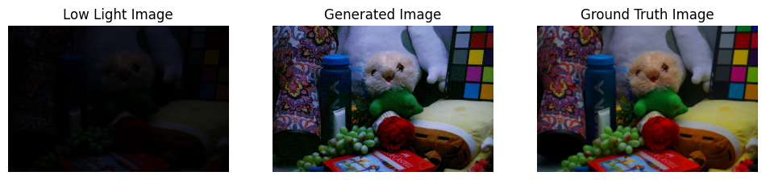

# **Unsupervised Reconstruction of High-Quality Images from Low-Light Images**

## **Project Overview**  
This project is part of the **IE643 course** and focuses on the **unsupervised enhancement of low-light images**. The objective is to transform **low-light, low-resolution images** into **high-light, high-resolution images**, addressing challenges like poor visibility and limited details.

> **Note:** The code for experiments is not included here. You can clone the original repositories for the respective experiments:
> - [EnlightenGAN](https://github.com/VITA-Group/EnlightenGAN)
> - [SCI](https://github.com/tengyu1998/SCI)
> - [ESRGAN](https://github.com/xinntao/ESRGAN)

> For implementation details, refer to the complete code in the notebook: [LowLightEnhancement.ipynb](LowLightEnhancement.ipynb) and for further details, consult the report: [Report.pdf](Report.pdf).  
---

## Method Overview

The proposed approach follows a **two-stage unsupervised pipeline**:
1. **Zero-DCE** enhances illumination in low-light images without paired supervision.
2. **ESRGAN** performs super-resolution to recover high-frequency details and improve perceptual quality.



**Figure:** Overall pipeline combining Zero-DCE for illumination enhancement and ESRGAN for super-resolution.
---


## **Implementation Steps**  

### **1. Setup WANDB**  
To implement this solution, create an account on [Weights & Biases (WANDB)](https://wandb.ai/). Once registered, retrieve your API key from the profile settings. This key is required for training the model and logging results.

---

### **2. Pre-Trained Model**  
If you prefer not to train the model:
- Download the pre-trained `model.h5` file.
- Place it in the **Colab working directory** for direct inference.

---

### **3. Streamlit UI**  

The code for the **Streamlit UI** is included under the **Streamlit UI** section at the end of the project.

#### **Instructions**:
1. Place the pre-trained model (`model.h5`) in the Colab working directory.
2. Run the commands provided under the **Streamlit UI** section to test the interface:

   ```bash
   !wget -q -O - ipv4.icanhazip.com
   ```

   This generates a **tunnel password**. Enter this password after clicking the generated link in the terminal.

3. While using Streamlit, permissions may be required for installations. Enter `y` when prompted.
4. Upload the images as directed on the UI screen to observe results.
5. For calculating quantitative metrics, upload the ground truth of the image along with the low-light image, and click on **Calculate Metrics**.

---

### **4. Visual Results**  

Below is an example of the project's output:




---

### **5. Quantitative Results**

To quantitatively evaluate the performance of the proposed approach, we use the following metrics:

- **PSNR (Peak Signal-to-Noise Ratio):** Measures reconstruction fidelity.
- **SSIM (Structural Similarity Index):** Measures perceptual and structural similarity.

### Comparison with Baseline Methods

| Method                     | PSNR (dB) | SSIM  |
|---------------------------|-----------|-------|
| EnlightenGAN + ESRGAN     | 19.08     | 0.5056 |
| SCI + ESRGAN              | 15.64     | 0.2768 |
| **Proposed (Zero-DCE + ESRGAN)** | **19.75** | **0.5223** |

---
## **References**  

- [Zero-DCE Keras](https://youtu.be/PGOWjMCMB8I?si=pefyKe2gfMt3O-xJ)  
- [Image Enhancing with TensorFlow Hub](https://www.tensorflow.org/hub/tutorials/image_enhancing)  
- [EnlightenGAN Repository](https://github.com/VITA-Group/EnlightenGAN)  
- [SCI Repository](https://github.com/tengyu1998/SCI)  
- [ESRGAN Repository](https://github.com/xinntao/ESRGAN)  
- [TensorFlow Object Detection Tutorial](https://colab.research.google.com/github/MarkDaoust/models/blob/tf_slim-2/research/object_detection/object_detection_tutorial.ipynb)  

